# Rust 重要概念まとめ

## 全体像

```mermaid
graph TD
    A[Rustのメモリ管理] --> B[所有権]
    A --> C[メモリ配置]
    A --> D[参照と借用]

    B --> B1[所有者は常に1つ]
    B --> B2[スコープを抜けると破棄]
    B --> B3[所有権はムーブできる]

    C --> C1[スタック]
    C --> C2[ヒープ]

    D --> D1["&T（不変参照）"]
    D --> D2["&mut T（可変参照）"]

    A --> E[ライフタイム]
    E --> E1["'a ラベルで参照をグループ化"]
    E --> E2["省略規則で自明な場合は省略可"]

    A --> F[スマートポインタ]
    F --> C3["Box&lt;T&gt; — 単一所有でヒープに置く"]
    F --> F1["Rc&lt;T&gt; — 複数で共有（読むだけ）"]
    F --> F2["RefCell&lt;T&gt; — 実行時借用チェックで書き換え可能"]
    F --> F3["Weak&lt;T&gt; — 循環参照を防ぐ弱い参照"]

    A2[Rustの型システム] --> G[トレイト]
    A2 --> H[ジェネリクス]
    A2 --> I[トレイト境界]

    G --> G1["TSのinterfaceに相当"]
    G --> G2["メソッドの契約を定義"]
    H --> H1["TSのジェネリクスと同じ"]
    I --> I1["TSのextendsに相当"]
    I --> I2["型パラメータに制約を付ける"]
```

## 1. 所有権（Ownership）

3つのルール:

1. **値の所有者は常に1つ**
2. **所有者がスコープを抜けると値は破棄される**
3. **所有権は移動（ムーブ）できる**

```rust
let a = String::from("hello");  // a が所有者
let b = a;                      // 所有権が b にムーブ
// a はもう使えない
```

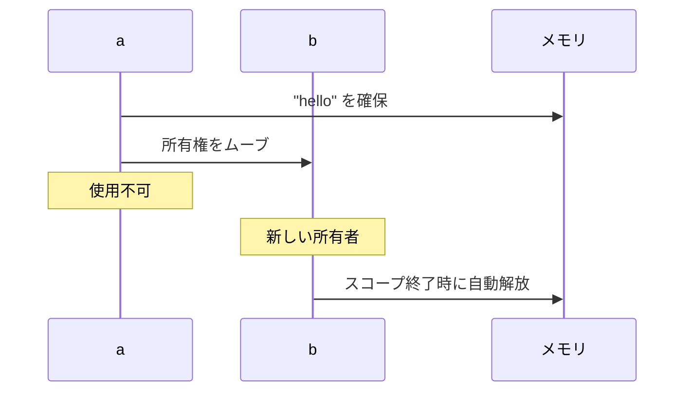

## 2. メモリ配置: スタック vs ヒープ

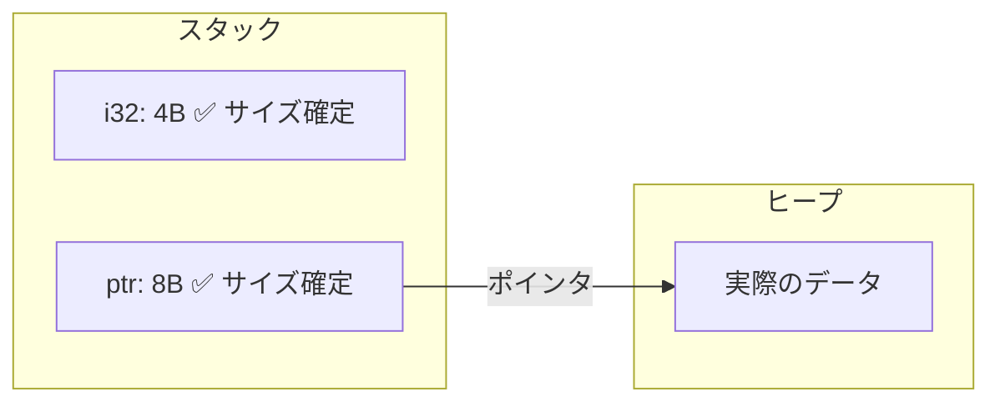

| | スタック | ヒープ |
|--|---------|--------|
| サイズ | コンパイル時に確定が必要 | 自由 |
| 速度 | 速い | 遅い |
| 用途 | 通常の変数 | サイズ不定・大きなデータ |

## 3. 参照と借用（References & Borrowing）

所有権を移さずに値を使う仕組み。

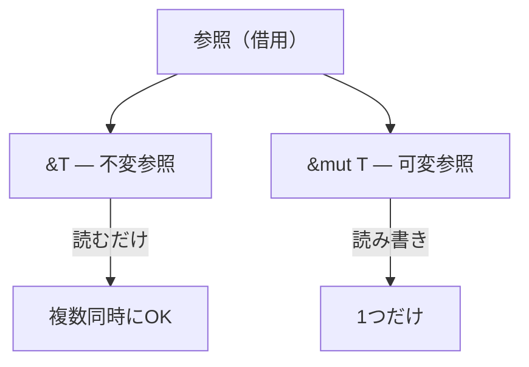

### ルール

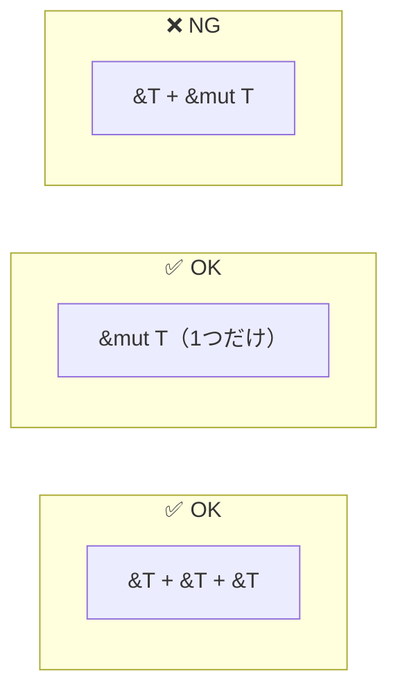

```rust
// 不変参照（読むだけ、複数OK）
let s = String::from("hello");
let r1 = &s;
let r2 = &s;  // OK

// 可変参照（読み書き、1つだけ）
let mut s = String::from("hello");
let r = &mut s;
r.push_str(" world");  // OK

// 不変 + 可変 の同時使用は不可
let mut s = String::from("hello");
let r1 = &s;
let r2 = &mut s;  // エラー！
```

### 借用まとめ

| | `&T`（不変の借用） | `&mut T`（可変の借用） |
|--|------|----------|
| 読み取り | OK | OK |
| 書き換え | NG | OK |
| 同時に複数 | OK | 1つだけ |

## 4. ライフタイム（Lifetime）

**参照がどのくらいの期間有効かをコンパイラに教えるためのラベル。**

### なぜ必要か

関数が複数の参照を受け取って参照を返すとき、返り値がどの引数の寿命に従うかコンパイラにはわからない。

```rust
// エラー！返り値は x と y どっちの寿命？
fn longest(x: &str, y: &str) -> &str {
    if x.len() > y.len() { x } else { y }
}
```

呼び出し側で `x` と `y` の寿命が異なる可能性があるため、どちらの寿命でチェックすべきか判断できない。

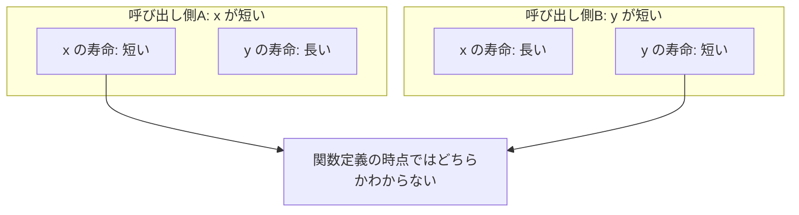

### ライフタイム注釈で解決

`'a` はラベル（グループ名）。同じラベルを付けた参照は「同じグループ」として扱われる。

```rust
fn longest<'a>(x: &'a str, y: &'a str) -> &'a str {
    if x.len() > y.len() { x } else { y }
}
```

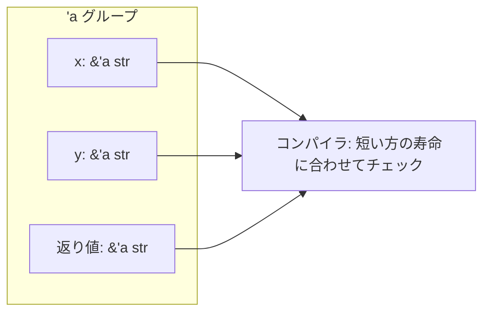

### ラベルの使い分け

```rust
// 同じラベル → 返り値は x と y 両方の寿命に縛られる
fn longest<'a>(x: &'a str, y: &'a str) -> &'a str

// 別ラベル → 返り値は x の寿命だけに縛られる（y は関係ない）
fn foo<'a, 'b>(x: &'a str, y: &'b str) -> &'a str {
    x  // y は返せない
}
```

### ライフタイム省略規則

引数の参照が1つだけなら、返り値もそれに従うのは自明なので省略できる。

```rust
// 省略形（書かなくてOK）
fn first_word(s: &str) -> &str

// コンパイラが内部的にこう解釈している
fn first_word<'a>(s: &'a str) -> &'a str
```

**書く必要があるのは参照が複数あって自明でないときだけ。**

### ダングリングポインタ — ライフタイムが防ぐもの

参照先がすでに破棄されたのに、参照だけが残っている状態。C言語では実行時のクラッシュやバグの原因になるが、Rustではコンパイル時にエラーで防がれる。

```rust
fn setData(data_a: &mut DataA, data_b: &mut DataB, num: i32) {
    let number = Box::new(num + 10);  // number はこの関数内で生まれる
    data_a.number_a = Some(&number);  // number を借りる
    data_b.number_b = Some(&number);  // number を借りる
}  // ← number が死ぬ。data_a, data_b は生きている → エラー！
```

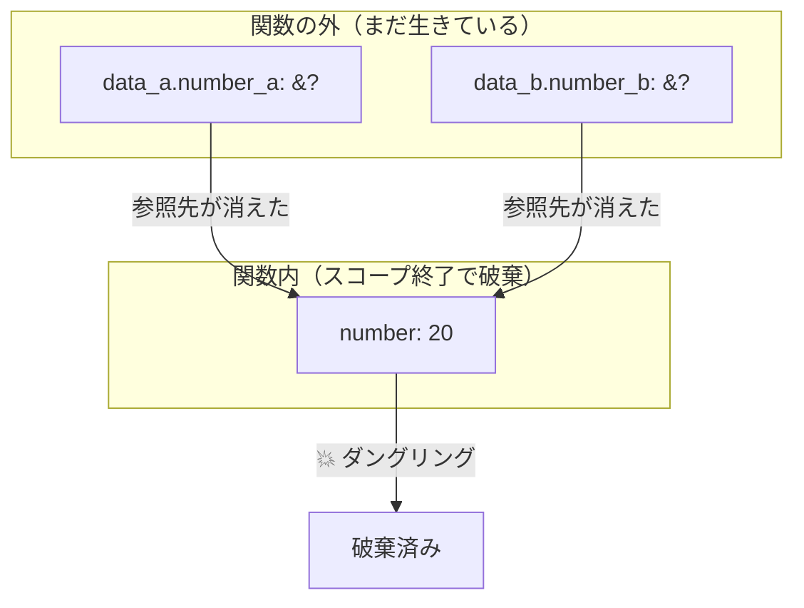

**ライフタイムのチェックにより、この状態がコンパイル時に検出される。**

## 5. スマートポインタ

### 5.1 Box\<T\> — 単一所有でヒープに置く

**なぜ必要か:** スタックにはコンパイル時にサイズが確定した値しか置けないため。

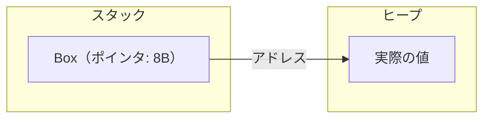

#### 再帰型での活用例

```rust
enum List {
    Cons(i32, Box<List>),  // Boxでサイズを固定
    Nil,
}
```

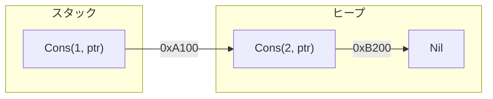

#### C言語の malloc との違い

| | malloc (C) | Box (Rust) |
|--|-----------|------------|
| 確保 | `malloc()` | `Box::new()` |
| 解放 | `free()` 手動 | **自動（スコープ終了時）** |
| 安全性 | メモリリークの危険 | **所有権で保証** |

### 5.2 Rc\<T\> — 複数で共有（読むだけ）

**問題:** 1つの値を複数の変数で使いたいが、`Box` は所有者が1つだけ。

- 参照（`&T`）で持たせる → 参照先が先に死ぬとダングリングポインタ
- 所有権（`Box<T>`）で持たせる → 所有者は1つだけなので2つ目に渡せない

→ `Rc<T>` で解決。

#### Box::clone vs Rc::clone

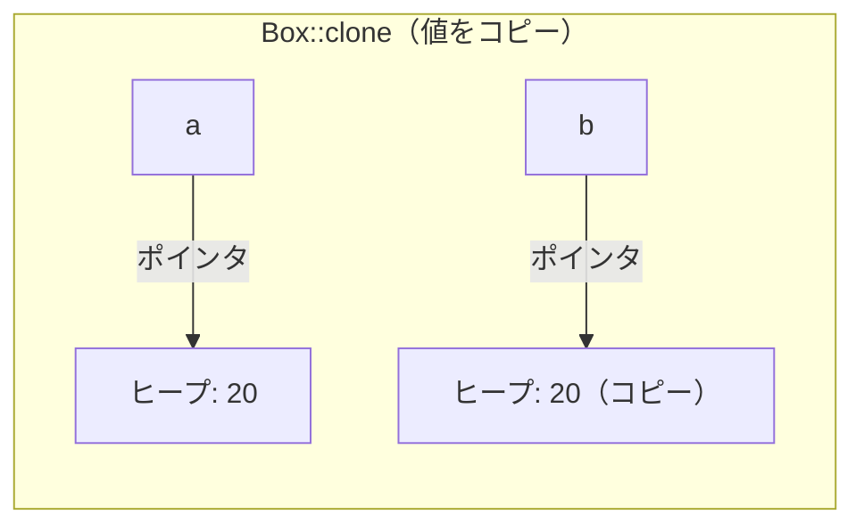

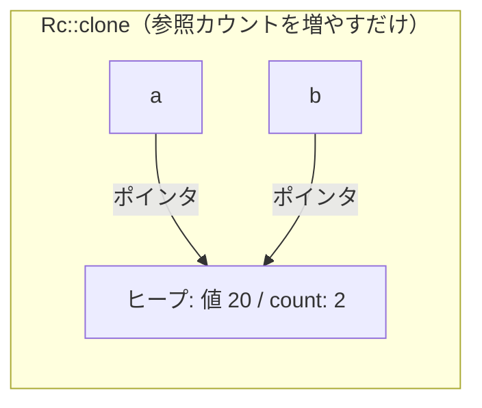

| | `Box<T>` | `Rc<T>` |
|--|---------|---------|
| 所有者 | 1つだけ | 複数OK |
| clone | ヒープの値を丸ごとコピー | カウントを+1するだけ（軽い） |
| 解放タイミング | 所有者がスコープを抜けたとき | カウントが0になったとき |
| 用途 | 単一所有でヒープに置きたい | 複数の変数で1つの値を共有したい |

#### Rc の動作イメージ

```rust
use std::rc::Rc;

let a = Rc::new(20);       // ヒープに 20 を確保。count: 1
let b = Rc::clone(&a);     // 同じヒープを共有。count: 2
let c = Rc::clone(&a);     // 同じヒープを共有。count: 3

drop(c);                   // count: 2
drop(b);                   // count: 1
drop(a);                   // count: 0 → ヒープのデータが解放される
```

**カウントが0になって初めて解放されるので、どの変数が先に死んでも安全。**

#### clone の書き方

`Rc` の clone は `a.clone()` でも動くが、**`Rc::clone(&a)` が推奨**。

```rust
let b = a.clone();       // 動くが非推奨
let b = Rc::clone(&a);   // 推奨
```

`a.clone()` だと値のディープコピー（`Box::clone` のような重い処理）と見分けがつかない。`Rc::clone(&a)` と書くことで「カウントを増やすだけの軽い操作」であることがコード上で明確になる。

### 5.3 RefCell\<T\> — 実行時の借用チェックで書き換え可能に

**問題:** `Rc<T>` は複数の変数で値を共有できるが、中身は書き換えられない。

```rust
let shared = Rc::new(5);
// *shared = 10;  // エラー！Rc の中身は変更できない
```

#### RefCell で書き換え可能にする

`RefCell<T>` は通常の借用ルール（`&T` / `&mut T`）と同じルールを**実行時に**チェックすることで、中身の書き換えを可能にする。

```rust
use std::cell::RefCell;

let cell = RefCell::new(5);

cell.borrow()       // &T に相当（読むだけ）
cell.borrow_mut()   // &mut T に相当（読み書き）

*cell.borrow_mut() = 10;  // * で中身にアクセスして書き換え
```

#### 借用ルールのチェックタイミング

ルール自体は同じ。チェックのタイミングだけが違う。

| ルール | 通常の `&T` / `&mut T` | `RefCell` |
|--|--|--|
| 不変の借用は複数OK | OK | OK |
| 可変の借用は1つだけ | OK | OK |
| 不変と可変の同時使用はNG | OK | OK |
| **チェックのタイミング** | **コンパイル時（エラー）** | **実行時（パニック）** |

#### Rc\<RefCell\<T\>\> — 複数で共有しつつ書き換え可能に

`Rc<T>` だけだと作った後に中身を変えられない。`Rc<RefCell<T>>` にすると変えられる。

```rust
use std::rc::Rc;
use std::cell::RefCell;

struct Node {
    data: i32,
    child: Option<Rc<RefCell<Node>>>,
}

let node1 = Rc::new(RefCell::new(Node { data: 1, child: None }));
let node2 = Rc::new(RefCell::new(Node { data: 2, child: None }));

// あとから child を書き換えられる！
node1.borrow_mut().child = Some(Rc::clone(&node2));
```

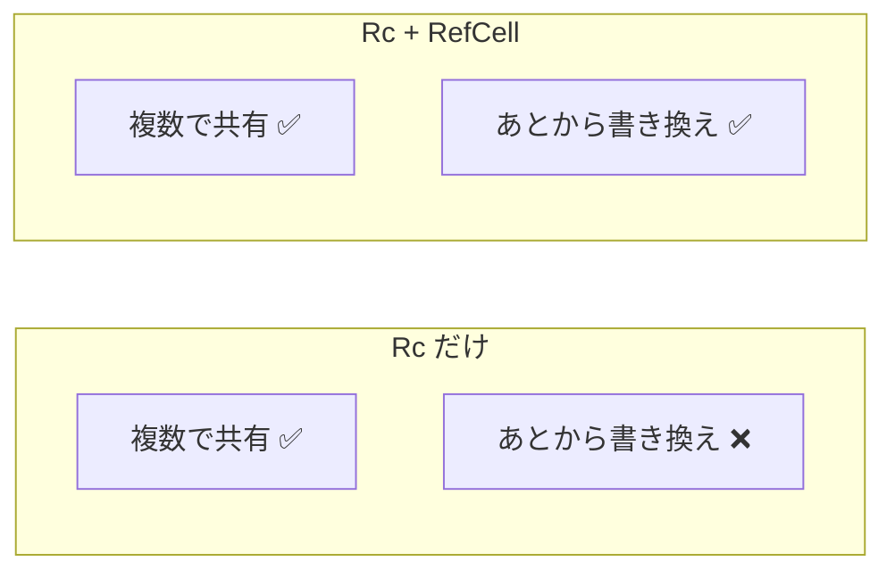

### 5.4 Weak\<T\> — 循環参照を防ぐ弱い参照

**問題:** `Rc` 同士で互いに参照すると、strong count が永遠に 0 にならずメモリが解放されない。

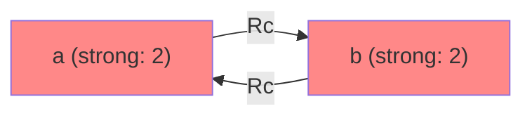

**スコープを抜けても strong count は 2→1 で止まり、0 にならない → メモリリーク**

#### 解決: 片方を Weak にする

`Weak` は strong count を増やさないので、循環していても解放できる。

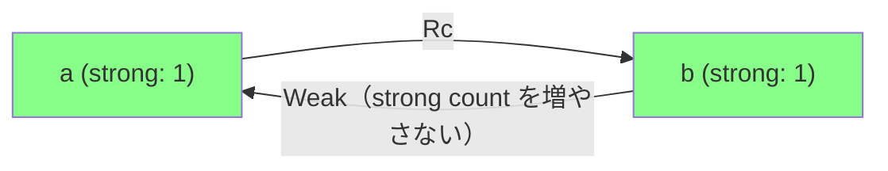

**スコープを抜けると strong count が 1→0 になり、正常に解放される。**

#### なぜ Weak + Weak ではダメか

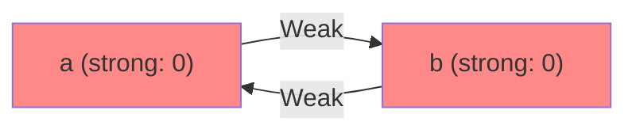

お互い strong count を増やさないので、**どちらもデータを保持できない。** 必ず片方は `Rc` で所有する必要がある。

#### コード例

```rust
use std::rc::{Rc, Weak};
use std::cell::RefCell;

struct Node {
    data: i32,
    child: Option<Rc<RefCell<Node>>>,     // 子 → Rc（所有する）
    parent: Option<Weak<RefCell<Node>>>,   // 親 → Weak（所有しない）
}
```

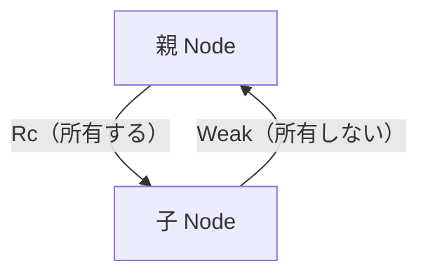

**親→子は `Rc` で所有し、子→親は `Weak` で参照だけする。これにより循環しても解放できる。**

### スマートポインタ比較表

| | `Box<T>` | `Rc<T>` | `Rc<RefCell<T>>` |
|--|---------|---------|-----------------|
| 所有者 | 1つだけ | 複数OK | 複数OK |
| 書き換え | OK | NG | OK |
| 借用チェック | コンパイル時 | コンパイル時 | **実行時** |
| 用途 | 単一所有 | 読むだけの共有 | 読み書きする共有 |

## 6. const vs static

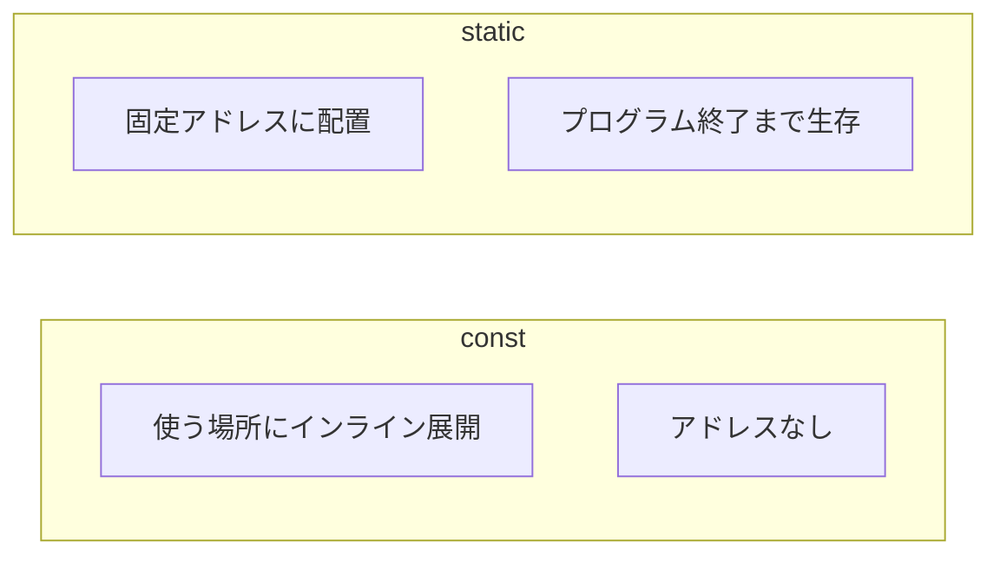

| | `const` | `static` |
|--|---------|----------|
| メモリアドレス | なし（インライン） | 固定で1つ |
| 生存期間 | なし（埋め込み） | プログラム全体 |
| 可変 | 不可 | `static mut` で可能（unsafe） |
| 用途 | 定数値 | グローバルな状態、FFI |

## 7. トレイト・ジェネリクス・トレイト境界

### トレイト（trait） — TSの interface に相当

型が実装すべきメソッドの契約を定義する。

```rust
// Rust
trait Summary {
    fn summarize(&self) -> String;
}

impl Summary for Article {
    fn summarize(&self) -> String {
        format!("{}", self.title)
    }
}
```

```typescript
// TypeScript
interface Summary {
    summarize(): string;
}

class Article implements Summary {
    summarize(): string {
        return this.title;
    }
}
```

#### Rust と TypeScript の違い

| | Rust トレイト | TypeScript interface |
|--|--|--|
| 型チェック | 明示的に `impl` が必要 | 構造が一致すれば自動で満たす（ダックタイピング） |
| デフォルト実装 | あり | なし |

```rust
// Rust: デフォルト実装を持てる
trait Summary {
    fn summarize(&self) -> String {
        String::from("(もっと読む)")  // デフォルト実装
    }
}
```

### ジェネリクス（Generics） — TSのジェネリクスと同じ

型をパラメータ化して汎用的なコードを書く仕組み。

```rust
// Rust
fn largest<T>(list: &[T]) -> &T { ... }
```

```typescript
// TypeScript
function largest<T>(list: T[]): T { ... }
```

### トレイト境界（Trait Bounds） — TSの extends に相当

ジェネリクスの型パラメータに「このトレイトを実装していること」という制約を付ける。

```rust
// Rust
fn notify<T: Summary>(item: &T) {
    println!("{}", item.summarize());
}

// 複数のトレイト境界
fn notify<T: Summary + Display>(item: &T) { ... }
```

```typescript
// TypeScript
function notify<T extends Summary>(item: T) {
    console.log(item.summarize());
}

// 複数の制約
function notify<T extends Summary & Display>(item: T) { ... }
```

#### where 句 — トレイト境界が長くなるときの書き方

```rust
// 境界が多いと読みにくい
fn some_function<T: Display + Clone, U: Clone + Debug>(t: &T, u: &U) { ... }

// where 句で見やすく
fn some_function<T, U>(t: &T, u: &U)
where
    T: Display + Clone,
    U: Clone + Debug,
{ ... }
```
