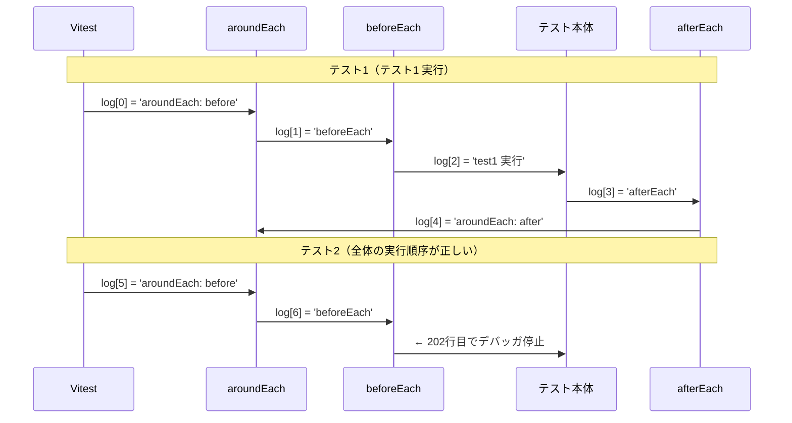
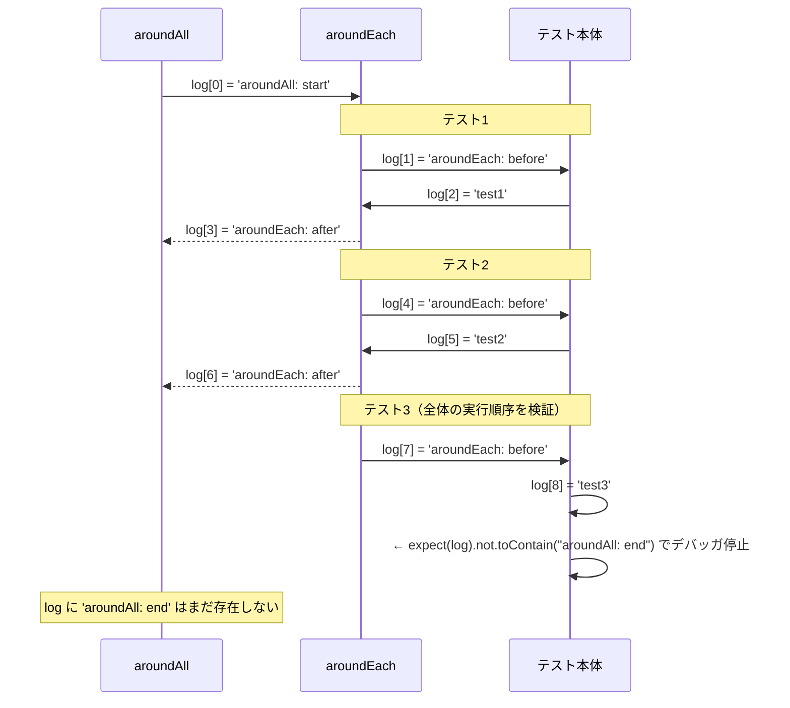

# Vitest 4.1でリリースされたaroundEach/aroundAllは何が便利なのか？

Vitest 4.1 で `aroundEach` と `aroundAll` という新しいライフサイクルフックが追加されました。

https://github.com/vitest-dev/vitest/releases

これらは文字通り、テストを **前後からwrapする** フックです。`aroundEach` は各テストを、`aroundAll` はスイート全体をwrapします。`runTest()` や `runSuite()` の呼び出しを自分のコードで囲む構造になっており、名前のとおり"around"に処理を置けます。

しかしここで疑問が浮かびます。既存の `beforeEach` / `afterEach` で書けていたことが多い中で、なぜ新しいフックが必要だったのか説明できますか？

このエントリでは実際にコードを動かしながら、`aroundEach` / `aroundAll` / `beforeEach` / `afterEach`のユースケースについて確認していきます。

# beforeEach / afterEach だけだと困ること

テストでよくあるパターンとして、「テストごとにDBトランザクションを張り、テスト後にロールバックする」があります。これはテスト後にゴミデータを残さないようにするためです。`beforeEach` / `afterEach` で書くと次のようになります。

```typescript
describe('beforeEach / afterEach でトランザクション管理', () => {
  const db = createFakeDB()
  let tx

  beforeEach(() => {
    tx = db.beginTransaction()
  })

  afterEach(() => {
    tx.rollback()
  })

  it('INSERT してもコミットしないのでcommittedに残らない', () => {
    tx.insert({ name: 'Alice' })
    expect(db.committed).toHaveLength(0)
  })
})
```

このコードは問題なく動作します。しかし、これは `beginTransaction()` / `rollback()` が独立して記述できるAPIの場合にのみ成立します。`beforeEach` / `afterEach`と独立したAPIしか提供しない場合、以下のような1つの本質的な問題と、2つの副次的な問題が考えられます。

## 1. コールバック形式のAPIとは組み合わせられない

本質的な問題です。ORMやトレーシングライブラリには、コールバック形式でコンテキストを提供するAPIが存在します。例えば [Sequelize](https://github.com/sequelize/sequelize) のトランザクションAPIはその代表例です。

```typescript
await sequelize.transaction(async (t) => {
  await User.create({ name: 'Alice' }, { transaction: t })
})
```

この場合、トランザクションはコールバックの中でしか有効ではなく、外に持ち出せません。このAPIでテストをトランザクションで包もうとすると、`beforeEach` でトランザクションを「開き」、`afterEach` で「最後にロールバックする」という分割が**そもそも成立しません**。そのため<u>`beforeEach`でデータを作成し、`afterEach`で作成したデータを削除する という2つのトランザクションに分けるアプローチを取る必要があります</u>。これはテストデータが多くなる場合、非常に低速になり得ます。

よって、この問題を解決するためには、コールバックの中でテストを実行できる仕組みが必要なのです((これが`aroundEach`の元issueで提起されている問題点です。 https://github.com/vitest-dev/vitest/issues/5728))。

## 2. `tx` を必要以上に広いスコープに置かざるを得ない

コールバック形式でないAPIであっても、`beforeEach` / `afterEach` には構造的な書きにくさがあります。`tx` は `beforeEach` の中で生成し `afterEach` の中で使うため、2つの関数をまたいで値を共有するには外側スコープに変数を置くしかありません。`tx` は `beforeEach` が呼ばれるまで未初期化のまま `describe` ブロックのトップに宙に浮いています。

## 3. 対になるべき処理が離れた場所に書かれる

`beginTransaction()` と `rollback()` はセットで意味をなす操作ですが、コード上では `beforeEach` と `afterEach` に分断されています。初めてコードを読む人は「この `tx` はどこで作られて、どこで閉じられるのか」を上下に視線を動かして確認しなければなりません。変数の宣言・初期化・後処理が3か所に散らばることで、コードの意図を把握するコストが上がります。

# aroundEach で解決する

`aroundEach` のコールバックは `runTest` という関数を受け取ります（引数名は任意）。`runTest()` を呼び出すと、`beforeEach`・テスト本体（`it`/`test`）・`afterEach`・フィクスチャを含む**1テスト分の全処理**が実行されます。

```typescript
describe('aroundEach の実行順序ログ', () => {
  const log = []

  aroundEach(async (runTest) => {
    log.push('aroundEach: before')
    await runTest()
    log.push('aroundEach: after')
  })

  beforeEach(() => { log.push('beforeEach') })
  afterEach(() => { log.push('afterEach') })

  it('テスト1', () => {
    log.push('test1 実行')
  })

  it('全体の実行順序が正しい', () => {
    expect(log[0]).toBe('aroundEach: before')
    expect(log[1]).toBe('beforeEach')
    expect(log[2]).toBe('test1 実行')
    expect(log[3]).toBe('afterEach')
    expect(log[4]).toBe('aroundEach: after')
  })
})
```

これが本当か？を確認してみます。expect(log[0]).toBe('aroundEach: before')`でブレークを貼って`log`の中身を見ると、以下のようになっています。

[f:id:inorinrinrin:20260328122001p:plain]



この図からわかるとおり、`runTest()` を呼ぶと `beforeEach`・テスト本体・`afterEach` がこの順で実行されます。デバッガが2つ目のテスト冒頭で止まった時点で、そのテスト自身の `aroundEach: before` と `beforeEach` がすでに `log[5]`・`log[6]` に積まれているのはそのためです。

つまり `runTest()` の前後に処理を書くことで、テストを任意のコンテキストで包めるということがわかりました。これにより、`beforeEach` / `afterEach`しかない世界での問題点を以下のように解決できます。

## コールバック形式のAPIとの組み合わせ

前述の Sequelize の例は `aroundEach` で自然に書けます。

```typescript
aroundEach(async (runTest) => {
  await sequelize.transaction(async (transaction) => {
    await runTest()
    await transaction.rollback()
  })
})
```

## 独立しているAPIも一連の流れの中で書ける

`beginTransaction()` / `rollback()` のようにトランザクションの開始とロールバックが独立した形式のAPIも、`aroundEach` を使うと1つの関数に収まります。

```javascript
describe('aroundEach でトランザクション管理', () => {
  const db = createFakeDB()

  aroundEach(async (runTest) => {
    const tx = db.beginTransaction() 
    await runTest()
    tx.rollback()
  })

  it('INSERT してもロールバックされる', () => {
    expect(db.committed).toHaveLength(0)
  })

  it('2件目のテストでも同様にロールバックされる', () => {
    expect(db.committed).toHaveLength(0)
  })
})
```

`tx` はクロージャ内のローカル変数になり、外側スコープに漏れません。`beginTransaction()` と `rollback()` が隣り合って書かれるため、対になっていることも一目でわかります。

# aroundAll — スイート全体を包む

`aroundEach` がテスト1件ごとのラッパーなのに対し、`aroundAll` は**スイート全体を1つのコンテキストで包む**フックです。

```typescript
describe("aroundAll と aroundEach の共存", () => {
    const log: string[] = [];

    aroundAll(async (runSuite) => {
        log.push("aroundAll: start");
        await runSuite();
        log.push("aroundAll: end");
    });

    aroundEach(async (runTest) => {
        log.push("aroundEach: before");
        await runTest();
        log.push("aroundEach: after");
    });

    it("テスト1", () => {
        log.push("test1");
    });

    it("テスト2", () => {
        log.push("test2");
    });

    it("全体の実行順序を検証", () => {
        log.push("test3");
        expect(log[0]).toBe("aroundAll: start");
        expect(log[1]).toBe("aroundEach: before");
        expect(log[2]).toBe("test1");
        expect(log[3]).toBe("aroundEach: after");
        expect(log[4]).toBe("aroundEach: before");
        expect(log[5]).toBe("test2");
        expect(log[6]).toBe("aroundEach: after");
        expect(log[7]).toBe("aroundEach: before");
        // aroundAll: end はまだ記録されていない
        expect(log).not.toContain("aroundAll: end");
    });
});
```

[f:id:inorinrinrin:20260328123116p:plain]



`aroundAll: start` はスイートの開始時に1回だけ実行され、`aroundAll: end` は全テスト完了後に1回だけ実行されます。テスト3の中で `aroundAll: end` がまだ記録されていないことを確認することで、「全テストが終わるまで aroundAll の後半は実行されない」という動きを検証できました。

## aroundAll のユースケース

`aroundAll` が活きるのは、**スイート全体を1つのコンテキスト内に置きたい**場面です。

### トレーシングスパン

```javascript
aroundAll(async (runSuite) => {
  await tracer.trace('test-suite-name', runSuite)
})
```

`beforeAll` でスパンを開始して `afterAll` で閉じる書き方と違い、スパンオブジェクトをスコープ外に持ち出さずに済みます。

### AsyncLocalStorage によるコンテキスト伝播

```javascript
aroundAll(async (runSuite) => {
  await storage.run({ requestId: 'test-run-001' }, runSuite)
})
```

`AsyncLocalStorage.run()` はコールバック形式のAPIです。`beforeAll` / `afterAll` に分割して書けない、つまり `aroundAll` でなければ実現できないパターンです。

# おわりに

`aroundEach` / `aroundAll` が解決する問題を整理すると、次のようになります。

| 問題 | beforeEach / afterEach | aroundEach / aroundAll |
|---|---|---|
| コールバック形式のAPI（`sequelize.transaction()` など） | 分割できないため組み合わせ不可 | `runTest()` をコールバックに渡せる |
| 変数スコープ | 外側スコープに `let` で宣言が必要 | クロージャ内のローカル変数で完結 |
| 対になる処理の距離 | `beforeEach` と `afterEach` に分断される | 1つの関数内に並べて書ける |
| スイート全体を包む | `beforeAll` / `afterAll` でコンテキストを持ち越せない | `aroundAll` で1つのコンテキストに収められる |

`aroundEach` / `aroundAll`は`beforeEach` / `afterEach` を置き換えるものではなく、「コンテキストをまたぐ必要がある処理」に対する補完的な選択肢です。

Vitest 4.1 では他にも便利な機能がたくさんリリースされています。しばらくはVitest関係の機能を紹介することになる...かも。
